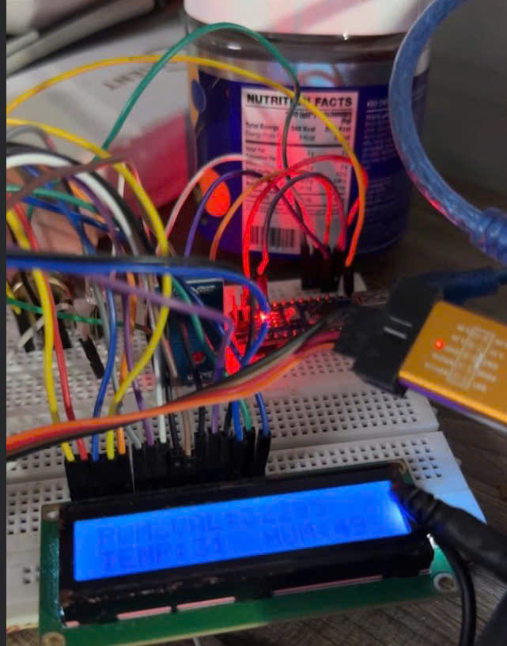

# PROJECT 8 – Tổng Hợp: ADC + DHT11 + LCD 16x02 + PWM LED

Dự án tổng hợp ngoại vi STM32F103 bao gồm ADC, PWM, Timer, LCD 16x02 và cảm biến DHT11.  
Toàn bộ giao thức LCD và DHT11 đều được xây dựng thủ công, không dựa trên bất kỳ library ngoài nào.

## 1. Chức năng chính

### 1.1. Đọc biến trở bằng ADC
- Sử dụng **ADC1 Channel 8**
- Công thức:
```
V = (ADC / 4095) * 3.3V
```
- Chuyển ADC sang PWM (0–65535)
- PWM xuất trên **TIM2_CH3**

### 1.2. Đọc DHT11
- Tự xây dựng giao thức bit-banging
- Start 18 ms, đọc 40 bit gồm Humidity / Temperature / Checksum
- Sử dụng delay_us bằng TIM1 CNT

### 1.3. LCD 16x02 chế độ 8-bit
Tự viết toàn bộ giao thức:
- lcd_send_command  
- lcd_write  
- lcd_go_to_xy  
- lcd_printf_string  

Hiển thị:
- Dòng 1: PWM_VALUE  
- Dòng 2: TEMP – HUM

### 1.4. Điều khiển LED theo nhiệt độ
- LED bật nếu `int_temp > 31°C`

### 1.5. delay_us bằng TIM1
- Độ chính xác cần thiết cho LCD và DHT11

## 2. Ảnh minh họa mạch



## 3. File chính
- **main.c** – chứa toàn bộ xử lý ADC, PWM, DHT11, LCD, delay_us

## 4. Ghi chú kỹ thuật
- PWM 16-bit  
- LCD mode 8-bit cần timing chuẩn  
- DHT11 yêu cầu delay_us chính xác 
