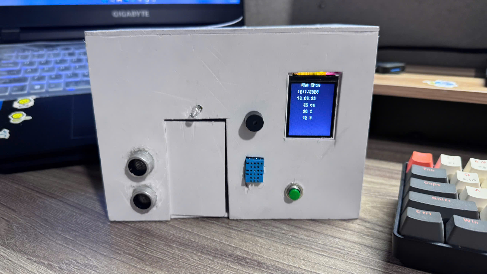
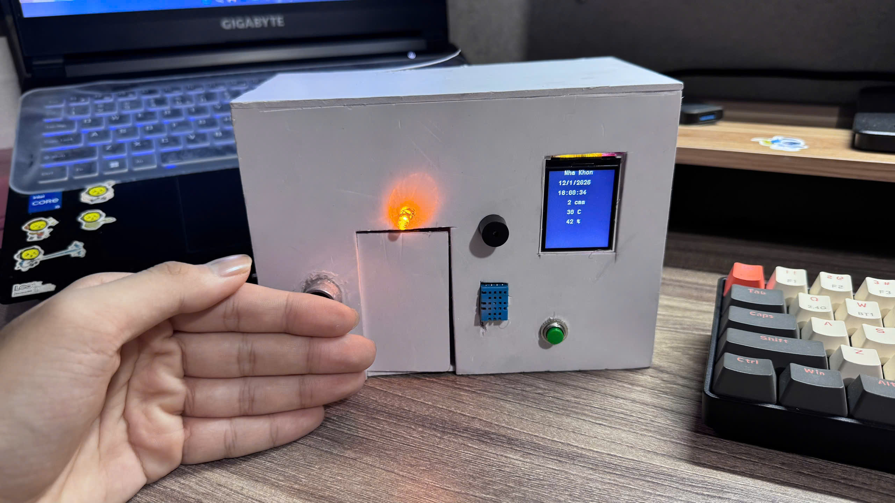
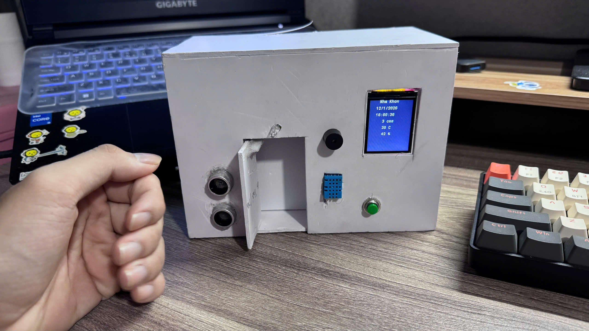
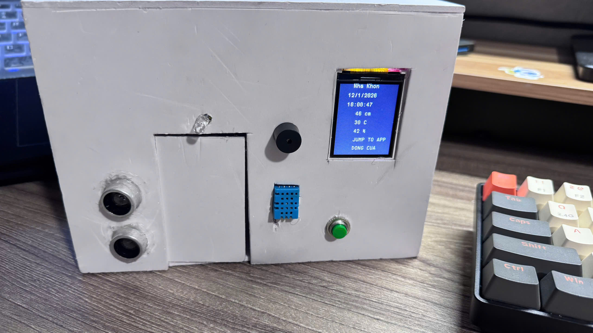
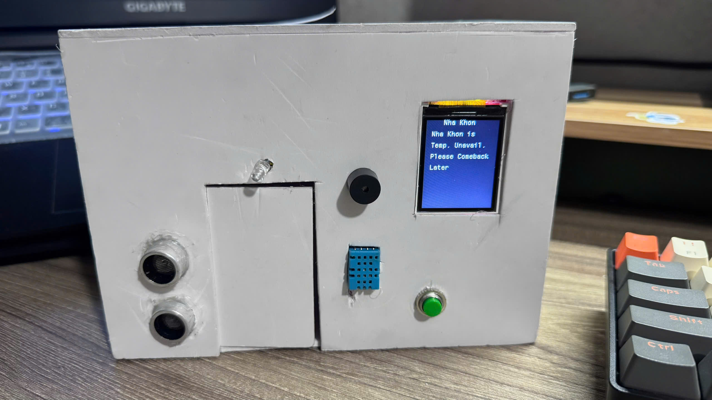

# MINI PROJECT 2 – STM32 HOME

## 1. Tổng quan dự án
- Dự án nhà "Khôn" chạy độc lập trên STM32
- Mục tiêu chính:
  - Ôn tập lại toàn bộ kiến thức đã tự học
  - Thử nghiệm các kiến thức cũ và mới trong quá trình tự học STM32
  - Cố gắng sử dụng nhiều chức năng nhất có thể trên STM32F103C8T6
- Toàn bộ logic điều khiển được triển khai trực tiếp trên vi điều khiển

## 2. Phạm vi và giả định
- Chạy HAL, super-loop, không sử dụng RTOS
- EMI, sụt áp, dây dài được xem là vấn đề thực tế của hệ thống
- Không tối ưu thương mại, ưu tiên đúng hành vi và ổn định
- Một số module được loại bỏ nếu không phù hợp phạm vi dự án cá nhân

## 3. Phần cứng sử dụng
- STM32 (VDK chính, xung 72 MHz)
- ESP32 (đồng bộ thời gian, UART)
- HC-SR04 (cảm biến khoảng cách)
- DHT11 (nhiệt độ, độ ẩm)
- Servo SG90 (đóng/mở cửa)
- DS3231 (RTC)
- TFT LCD 1.8” 128×160 (ST7735)
- Buzzer / LED

## 4. Giao tiếp và ngoại vi
- ESP32 <-> STM32: UART (USART1)
- HC-SR04: GPIO + TIM (timing chính xác)
- DHT11: GPIO + TIM / 1-Wire
- Servo SG90: TIM3 – PWM (CH1, PA6)
- DS3231: I2C (PB10 SCL, PB11 SDA)
- TFT LCD ST7735: SPI1 (PB3 SCK, PB5 MOSI)
- Jump Application: EXTI15 (PB15)

## 5. Cách thức hoạt động
### 5.1. Tiền khởi động
- Khởi tạo toàn bộ ngoại vi
- Khởi tạo LCD với giao diện gốc
- Cửa được đưa về trạng thái đóng an toàn
- Chuẩn bị dữ liệu thời gian từ DS3231 bằng cách lấy thời gian thực từ ESP32 qua trong tối đa 15s
- Nếu không có data, sử dụng thời gian hardcode sẵn

### 5.2. Trạng thái hoạt động
- Tất cả cảm biến cập nhật mỗi 0.5s
- LCD cập nhật giao diện (chỉ vị trí data) khi có thay đổi dât
- Nếu phát hiện vật thể < 8cm:
  - Buzzer cảnh báo 3 lần, 1 lần kêu 0.5s và led chớp tương tự
  - Cửa mở ra trong 3s, sau đó đóng lại
- Nếu ấn nút, thực hiện hiển thị "DONG CUA" và "JUMP TO APP", sau đó nhảy qua Application
- Trong Application, chỉ còi liên tục mỗi 1s, led chớp tương tự, LCD chỉ hiện "Nha Khon is temp...."

## 6. Kiến trúc phần mềm
- Mô hình super-loop
- Toàn bộ driver được thư viện hóa (.h / .c):
  - DHT11
  - HC-SR04
  - Servo SG90
  - LCD ST7735
  - DS3231

## 7. Bootloader và Application
- Hệ thống gồm 2 application ở 2 vùng nhớ khác nhau
- Application chính có khả năng jump sang application phụ
- Jump application thông qua ngắt ngoài (EXTI15)
- Application phụ:
  - Hiển thị trạng thái khóa tạm thời
  - Vô hiệu hóa toàn bộ cảm biến
  - Không quay về application chính trừ khi reset cứng

## 8. Các quyết định kỹ thuật
- Không sử dụng keypad do thiếu GPIO
- Không triển khai OTA qua ESP32 do giới hạn tài nguyên
- Tách nguồn servo riêng để tránh sụt áp, treo MCU
- Rút ngắn dây I2C để khắc phục nhiễu DS3231
- Loại bỏ GPS NEO-6M, chuyển sang đồng bộ thời gian qua ESP32

## 9. Nhật ký hoàn thiện dự án
- Toàn bộ cơ chế hoạt động đã hoàn tất
- Hệ thống chạy ổn định trong thời gian dài (>2 giờ)
- Các vấn đề phần cứng chính đã được xác định và xử lý
- Dự án được xem là hoàn thành

---

## Demo hoạt động
-Khi ở trạng thái bình thường:

-Khi gặp vật cản dưới 8cm sẽ báo còi và đèn:

- Cửa mở trong 3s sau đó đóng:
  

-Khi ấn nút, hệ thống vào trạng thái ngắt:

- Đã jump to application, nhà không hiển thị data 
- Báo còi liên tục và không cho vào

